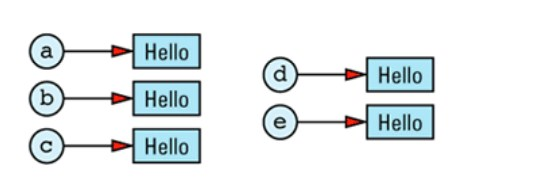
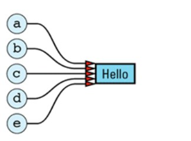
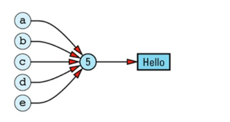

# 引用计数

要正确的理解智能指针，首先必须理解引用计数技术。

#### 深拷贝、浅拷贝的概念

- 深拷贝优缺点：
  - 优点：每一个的对象（哪怕是通过拷贝构造函数实例化的对象）的指针都有指向的内存空间，而不是共享，所以在对象析构的时候就不存在重复释放或内存泄露的问题了。
  - 缺点：内存开销大

- 浅拷贝优缺点：
  - 优点：通过拷贝构造函数实例化的对象的指针数据变量指向的共享的内存空间，因此内存开销较小。
  - 缺点：对象析构的时候就可能会重复释放或造成内存泄露。

​    鉴于深拷贝和浅拷贝的优缺点，可采用**引用计数**技术，既减小了内存开销，又避免了堆的重复释放或内存泄露问题。

##### 举例说明

在深拷贝的情况下，通过拷贝构造或者赋值构造的对象均各自包含自己的指针指向“Hello”。



但是，显然这样比较浪费内存，存在冗余，那么下面的版本更好：



我们使用代码来描述这一过程：

```c++
#include "stdafx.h"
#include <iostream.h>
#include <cstring>

class CStudent
{
public:
	CStudent(const char* pszName);
	CStudent(CStudent& obj);

	CStudent& operator=(CStudent& obj);

	void release();

	void Show()
	{
		cout << hex << (int&)m_pszName << m_pszName <<endl;
	}

private:
    char* m_pszName;	
};


CStudent::CStudent(const char* pszName)
{
	m_pszName = new char[256];

	strcpy(m_pszName, pszName);
}


CStudent::CStudent(CStudent& obj)
{
	m_pszName = obj.m_pszName;
	
	//strcpy(m_pszName, obj.m_pszName);
}


CStudent& CStudent::operator=(CStudent& obj)
{
	m_pszName = obj.m_pszName;

	return *this;
}

void CStudent::release()
{
	if (m_pszName != NULL)
	{
		delete m_pszName;
		m_pszName = NULL;
	}
}

int main(int argc, char* argv[])
{
	CStudent stu1("zhang san");

	CStudent stu2("li si");

	CStudent stu3 = stu2;


	stu1.Show();
	stu2.Show();
	stu3.Show();

	stu2.release();

	stu3.Show();

	return 0;
}
```

**这样做带来的问题**：

 但是这样同样存在问题，一旦其中一个对象释放了资源，那么所有的其他对象的资源也被释放了。

 **解决方法**：增加一个变量，记录**资源使用的次数**。



```C++
#include "stdafx.h"
#include <iostream.h>
#include <cstring>

class CStudent
{
public:
	CStudent(const char* pszName);
	CStudent(CStudent& obj);

	~CStudent();

	CStudent& operator=(CStudent& obj);

	void release();

	void Show()
	{
		if (*m_pCount > 0)
		{
			cout << hex << (int&)m_pszName << m_pszName <<endl;
		}
	}

private:
    char* m_pszName;
	int * m_pCount;
};


CStudent::CStudent(const char* pszName)
{
	m_pszName = new char[256];
	m_pCount  = new int;

	strcpy(m_pszName, pszName);

	*m_pCount = 1;
}


CStudent::CStudent(CStudent& obj)
{
	m_pszName = obj.m_pszName;
	
	m_pCount = obj.m_pCount;
	(*m_pCount)++;

}

CStudent::~CStudent()
{
	release();
}


CStudent& CStudent::operator=(CStudent& obj)
{
	if (obj.m_pszName == m_pszName)
	{
		return *this;
	}

	if (--(*m_pCount) == 0)
	{
		delete m_pszName;
		m_pszName = NULL;
		delete m_pCount;

	}

	m_pszName = obj.m_pszName;
	m_pCount = obj.m_pCount;

	(*m_pCount)++;

	return *this;
}

void CStudent::release()
{
	if (m_pszName != NULL && --*m_pCount == 0)
	{
		delete m_pszName;
		m_pszName = NULL;

		delete m_pCount;
	}
}

int main(int argc, char* argv[])
{
	CStudent stu1("zhang san");

	CStudent stu2("li si");

	CStudent stu3 = stu2;


	stu1.Show();
	stu2.Show();
	stu3.Show();

	stu2.release();
	stu3.release();

	stu3.Show();

	return 0;
}
```

最后，我们将该引用计数做一个简易的封装，也就是把引用计数作为一个新的类来使用：

```c++
#include "stdafx.h"
#include <iostream.h>
#include <cstring>

struct RefValue 
{

	RefValue(const char* pszName);
	~RefValue();

	void AddRef();
	void Release();

	char* m_pszName;
	int   m_nCount;
};

RefValue::RefValue(const char* pszName)
{
	m_pszName = new char[strlen(pszName)+1];
	
	m_nCount = 1;

}

RefValue::~RefValue()
{

	if (m_pszName != NULL)
	{
		delete m_pszName;
		m_pszName = NULL;
	}
}

void RefValue::AddRef()
{
	m_nCount++;
}

void RefValue::Release()
{
	if (--m_nCount == 0)
	{
		delete this;
	}
	
}


class CStudent
{
public:
	CStudent(const char* pszName);
	CStudent(CStudent& obj);

	~CStudent();

	CStudent& operator=(CStudent& obj);

	void release();

	void Show()
	{
		if (m_pValue->m_nCount > 0)
		{
			cout << hex << (int&)m_pValue->m_pszName << m_pValue->m_nCount <<endl;
		}
	}

private:
	RefValue* m_pValue;
};


CStudent::CStudent(const char* pszName)
{
	m_pValue = new RefValue(pszName);
}


CStudent::CStudent(CStudent& obj)
{
	m_pValue = obj.m_pValue;
	m_pValue->AddRef();
}

CStudent::~CStudent()
{
	release();
}


CStudent& CStudent::operator=(CStudent& obj)
{
	if (obj.m_pValue == m_pValue)
	{
		return *this;
	}

	m_pValue->Release();

	m_pValue = obj.m_pValue;
	m_pValue->AddRef();

	return *this;
}

void CStudent::release()
{
	m_pValue->Release();
}

int main(int argc, char* argv[])
{
	CStudent stu1("zhang san");

	CStudent stu2("li si");

	CStudent stu3 = stu2;


	stu1.Show();
	stu2.Show();
	stu3.Show();

	stu2.release();
	//stu3.release();

	stu3.Show();

	stu3.release();

	return 0;
}
```


**问题**：

上面的做法能在一定程度上解决资源多次重复申请的浪费，但是仍然存在两个核心的问题。

- 如果对其中某一个类对象中的资源进行了修改，那么所有引用该资源的对象全部会被修改，这显然是错误的。
- 当前的计数器作用于Student类，在使用时候，需要强行加上引用计数类，这样复用性不好，使用不方便。