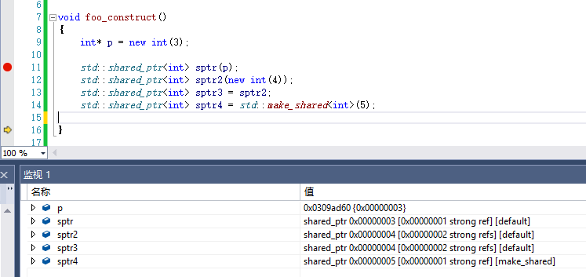
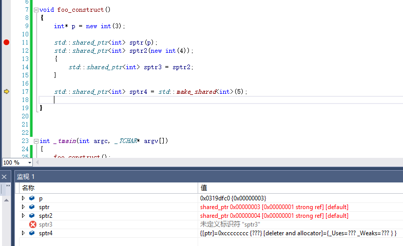
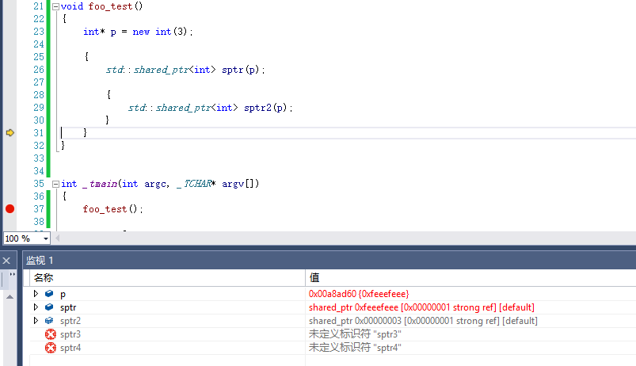
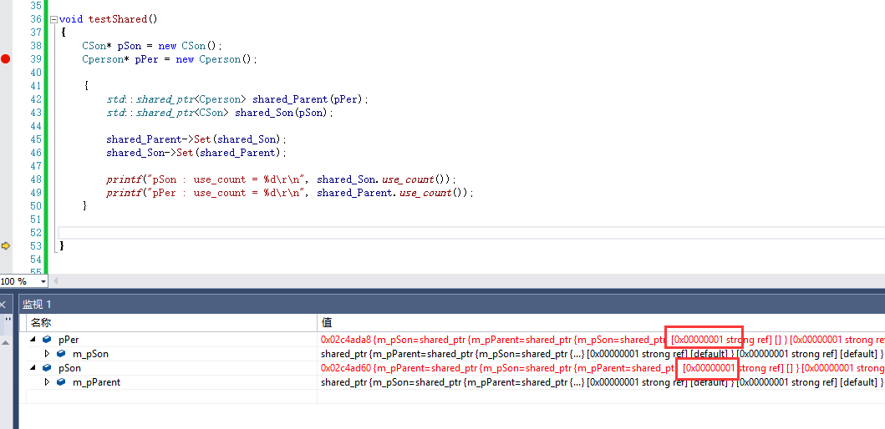
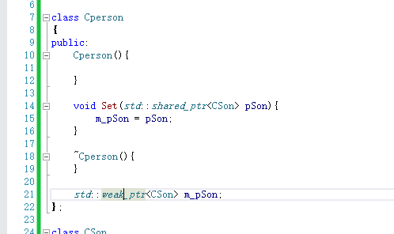
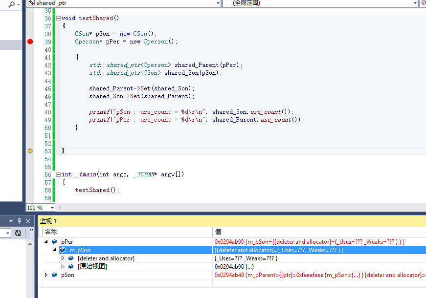

# shared_ptr与weak_ptr

shared_ptr是带引用计数的智能指针：

**1. 构造**

其初始化多了一种写法：std::make_shared<int>

 

```c++
void foo_construct()
{
    int* p = new int(3);

    std::shared_ptr<int> sptr(p);
    std::shared_ptr<int> sptr2(new int(4));
    std::shared_ptr<int> sptr3 = sptr2;
    std::shared_ptr<int> sptr4 = std::make_shared<int>(5);
}
```



这里显然可以看到有引用计数的存在。

通过修改上面例子种的sptr3的作用域，可以发现，出了块作用域之后，shared_ptr对应的引用计数的值减少了。

 

```c++
void foo_construct()
{
    int* p = new int(3);

    std::shared_ptr<int> sptr(p);
    std::shared_ptr<int> sptr2(new int(4));
    {
        std::shared_ptr<int> sptr3 = sptr2;
    }
    
    std::shared_ptr<int> sptr4 = std::make_shared<int>(5);

}

```



**2. 注意事项：**

1. 如果用同一个指针去初始化两个shared_ptr时，则引用计数仍然会出错：

 

```c++
void foo_test()
{
    int* p = new int(3);

    {
        std::shared_ptr<int> sptr(p);

        {
            std::shared_ptr<int> sptr2(p);
        }
    }
}
```



显然出了最里面的作用域之后，sptr2对象就已经释放了，此时，对于sptr2来说，p的引用计数为0，所有p被释放，但是实际上sptr还存在，所以再释放sptr时，就会0xc0000005.


2. shared_ptr最大的问题是存在循环引用的问题：

  如果两个类的原始指针的循环使用，那么会出现重复释放的问题：

 

 

```c++
class CPerson;
class CSon;

class Cperson
{
public:
    Cperson(){
        
    }

    void Set(CSon* pSon){
        m_pSon = pSon;
    }
    
    ~Cperson(){
        if (m_pSon != nullptr)
        {
            delete m_pSon;
            m_pSon = nullptr;
        }
    }

    CSon* m_pSon;
};

class CSon
{
public:
    CSon(){

    }

    void Set(Cperson* pParent){
        m_pParent = pParent;
    }

    ~CSon(){
        if (m_pParent != nullptr)
        {
            delete m_pParent;
            m_pParent = nullptr;
        }
    }

    Cperson* m_pParent;
};


int _tmain(int argc, _TCHAR* argv[])
{
    Cperson* pPer = new Cperson();
    CSon* pSon = new CSon();

    pPer->Set(pSon);
    pSon->Set(pPer);

    delete pSon;

    return 0;
}
```

  

这里，delete pSon会出现循环的调用父子类的析构函数，问题很大。

因此，这里考虑使用引用计数的shared_ptr来实现。

 

```c++
#pragma once

#include <memory>
class CPerson;
class CSon;

class Cperson
{
public:
    Cperson(){

    }

    void Set(std::shared_ptr<CSon> pSon){
        m_pSon = pSon;
    }

    ~Cperson(){
    }

    std::shared_ptr<CSon> m_pSon;
};

class CSon
{
public:
    CSon(){

    }

    void Set(std::shared_ptr<Cperson> pParent){
        m_pParent = pParent;
    }

    ~CSon(){
    }

    std::shared_ptr<Cperson> m_pParent;
};
```

 

```c++
void testShared()
{
    CSon* pSon = new CSon();
    Cperson* pPer = new Cperson();

    {
        std::shared_ptr<Cperson> shared_Parent(pPer);
        std::shared_ptr<CSon> shared_Son(pSon);

        shared_Parent->Set(shared_Son);
        shared_Son->Set(shared_Parent);

        printf("pSon : use_count = %d\r\n", shared_Son.use_count());
        printf("pPer : use_count = %d\r\n", shared_Parent.use_count());
    }


}
```

这里在出作用域后发现，实际上两个对象均未被销毁：



最后两者的引用计数均为1，原因是出了块作用域之后，两个shared_parent和shared_son均会析构，在这两个智能指针的内部，均会先去判断对应的内部指针是否-1是否为0，显然这里相互引用的情况下，引用计数初值为2，减1后值为1，所以两个指针均不会被释放。

这里，其实只需要一个释放了，另外一个也能跟着释放，可以采用弱指针，即人为的迫使其中一个引用计数为1，从而打破闭环。

这里只需要将上例子中的任意一个强指针改为弱指针即可。

举例：



最后的结果：

此时，两个内部指针均会得到释放。



原因是，弱指针的引用不会增加原来的引用计数，那么就使得引用不再是闭环，所以在出作用域之后，全部得到释放。

**weak_ptr的使用**

1. weak_ptr本身并不具有普通内部指针的功能，而只是用来观察其对应的强指针的使用次数。

2. 因此，这里弱指针的在使用上，实际上是一个特例，即不增加引用计数也能获取对象，因此，实际上在使用弱指针时，不能通过弱指针，直接访问内部指针的数据，而应该是先判断该弱指针所观察的强指针是否存在（调用expired()函数），如果存在，那么则使用lock()函数来获取一个新的shared_ptr来使用对应的内部指针。

3. 实际上，如果不存在循环引用，就不需要使用weak_ptr了，这种做法仍然增加了程序员的负担，所以不如java c#等语言垃圾回收机制省心。

  

 

```c++
void testWeak()
{
    std::shared_ptr<int> sharedPtr(new int(3));
    std::weak_ptr<int> weakPtr(sharedPtr);


    printf("sharedPtr_Count = %d, weakPtr_Count = %d, Value = %d \r\n", sharedPtr.use_count(), weakPtr.use_count(), *sharedPtr);
    //当weakPtr为空或者对应的shared_ptr不再有内部指针时，expired返回为true.
    if (!weakPtr.expired())
    {
        std::shared_ptr<int> sharedPtr2 = weakPtr.lock();
        printf("sharedPtr_Count = %d, weakPtr_Count = %d, Value = %d \r\n", sharedPtr.use_count(), weakPtr.use_count(), *sharedPtr);
        *sharedPtr2 = 5;
    }

    printf("sharedPtr_Count = %d, weakPtr_Count = %d, Value = %d \r\n", sharedPtr.use_count(), weakPtr.use_count(), *sharedPtr);
}
```

执行结果如下：

